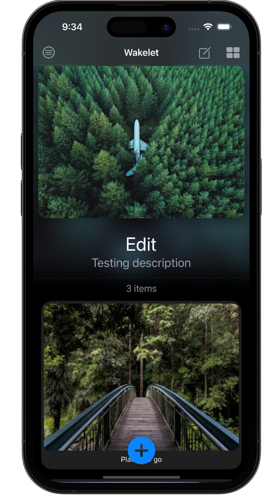
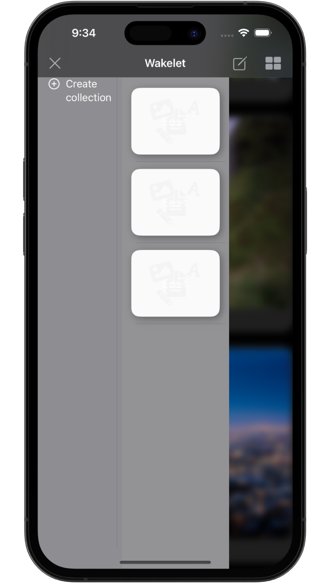
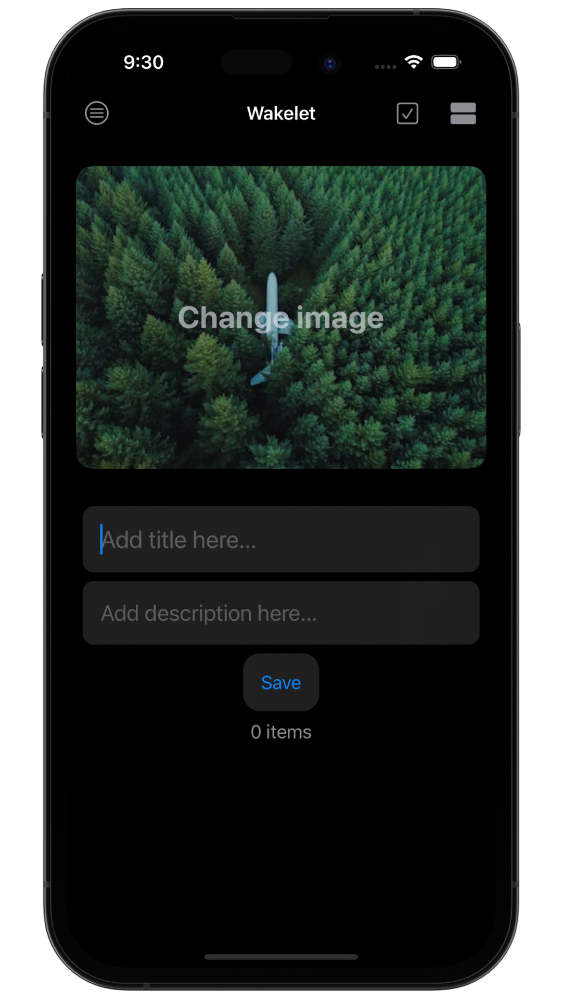

# &nbsp; 📖 Wakelet(Demo) 

### Personal project 
##### Author: *[MatviiArtemenko](https://github.com/MatveyArtemenko?tab=repositories)*

---
This is my first big project, which I managed myself, it's nowhere near perfection, but in the process of making it, I learned a lot through struggle, like SafariServices, Gestures working with grids of items, Unsplash API, Combine, converting images into data and saving them and much more. It was the hardest project I've made by far.
So basically it replicates a fraction of the functionality of the original app like creating collections with links for further use, editing them, and syncing them with a website.
It was built under the guidance of an IOS developer from [Wakelet](https://wakelet.com).

---

## &nbsp; 📚 Main topics

Networking, JSON, UnsplashAPI, ImagePicker, Converting data, SafariServices, SwiftUI

---
## &nbsp; 📲 Screenshoots

  
  
  

---
##  &nbsp; 🎮 &nbsp; Try it yourself 

#### To run it on you machine clone this project to your directory and run it in Xcode on a simulator.

##### P.S. For the project to run properly you will need you Wakelet account and to know your personal tokken, without it the app will not work.
##  &nbsp; 🔍 &nbsp; Resources 

* [Apple documentation - Safari Services](https://developer.apple.com/documentation/safariservices/)

* [Hacking with Swift - Photo Picker](https://www.hackingwithswift.com/quick-start/swiftui/how-to-let-users-select-pictures-using-photospicker)

* [Unsplash developers - Documentation](https://unsplash.com/documentation#search-photos)

